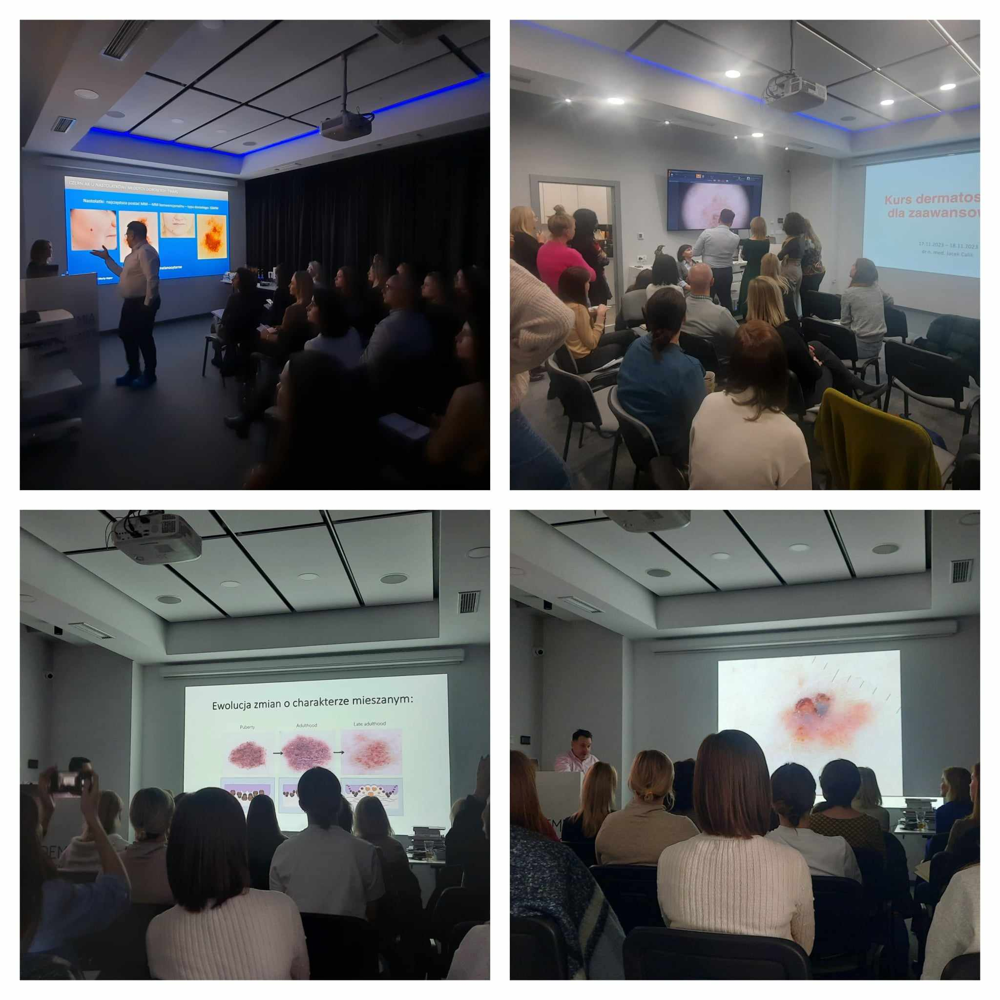

Za nami ostatni w tym roku kurs dermatoskopowy na poziomie zaawansowanym! Tym razem dr n.med. Jacek Calik współprowadził kurs w duecie z dr n. med. Elżbietą Wójtowicz. Wiele rzadkich przypadków omawianych na licznych przykładach obrazów dermatoskopowych i wiele zagadnień, które poruszane są jedynie na kursie zaawansowanym – tak można podsumować dwa dni pełne nauki, wymiany doświadczeń i spostrzeżeń. Dziękujemy dr n.med. Elżbiecie Wójtowicz za wkład merytoryczny, sposób i chęć przekazywania wiedzy. Uczestnikom dziękujemy za aktywny udział i zaangażowanie!

