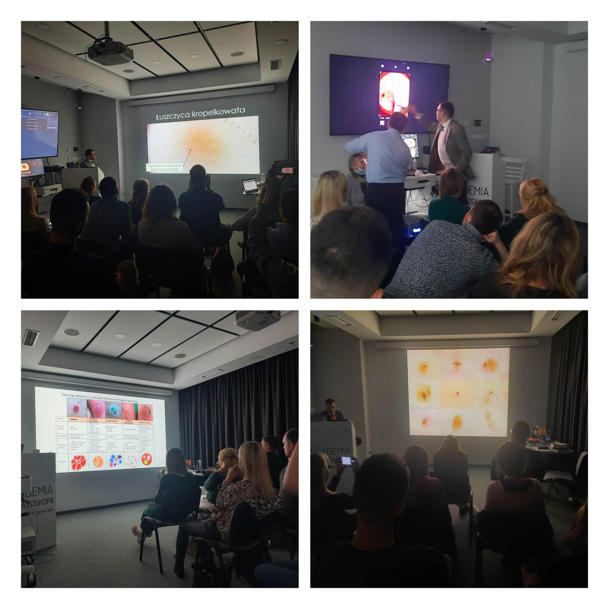

Za nami ostatni w tym roku kurs dermatoskopowy na poziomie zaawansowanym!  
Prowadzącymi niezmiennie dr n. med. Jacek Calik oraz dr n. med. Paweł Pietkiewicz.  
To dwa dni pełne wymiany nauki i omawiania przypadków na licznych przykładach!  
Dziękujemy uczestniczącym w kursie lekarzom za zaangażowanie i chęć nauki!  
Kolejny kurs dermatoskopowy zaawansowany w terminie 24-25.03.2023.  
Zapraszamy do zapisów: kontakt@akademiadermatoskopii.pl lub tel. 516-516-065  
Do zobaczenia!

