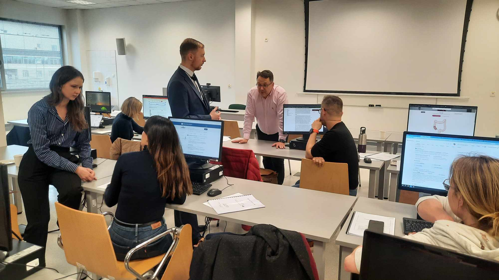
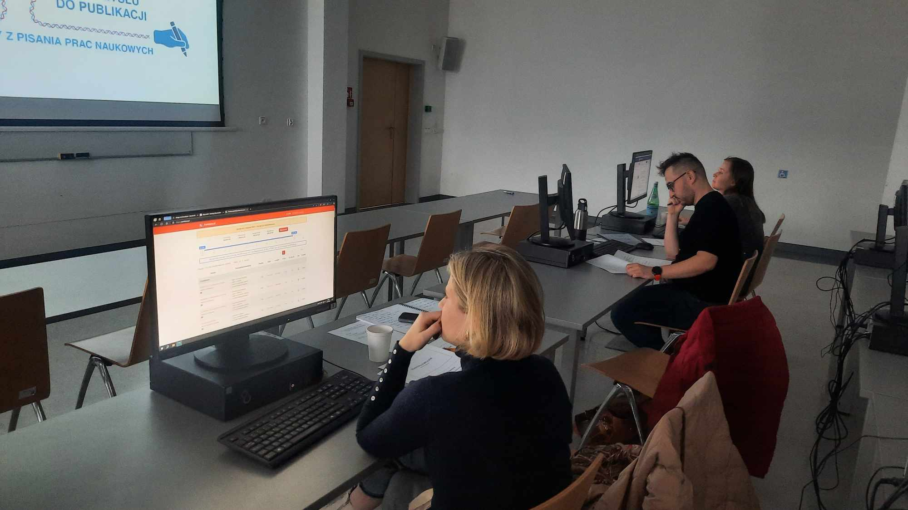
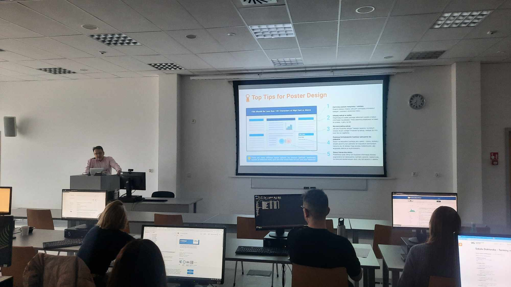
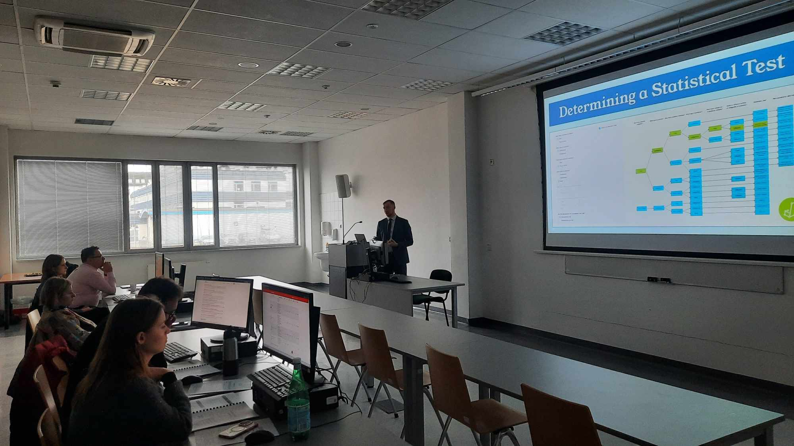
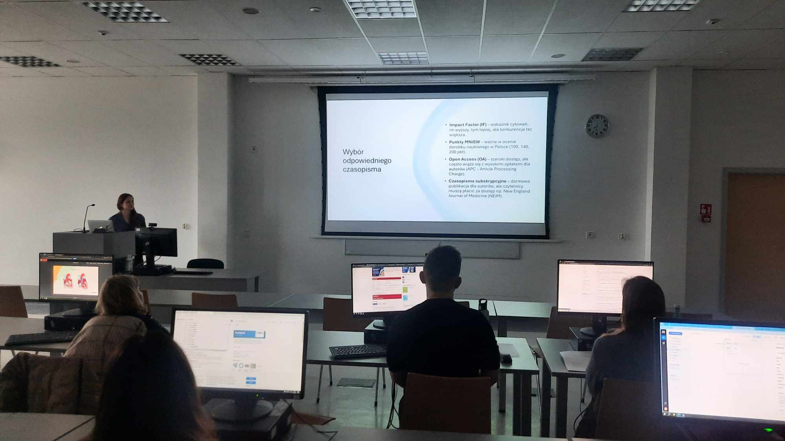

W sobotę na Wydziale Farmaceutycznym Uniwersytetu Medycznego we Wrocławiu odbył się pierwszy Kurs z pisania prac naukowych!

Uczestniczący w nim lekarze mieli okazję dowiedzieć między innymi w jaki sposób formułować hipotezę, jaką wybrać metodologię badań, w jaki sposób zwizualizować dane z użyciem dedykowanych do tego programów. Omówiony został także proces publikacji. Nie mogło zabraknąć cześci warsztatowej, która zaaowocowała wielkoma pomysłami tematów prac naukowych! Dziękujemy za Państwa zaangażowanie i liczymy, że wkrótce będziemy mieli okazję zapoznać się z Państwa publikacjami!

Kolejny Kurs z pisania prac naukowych już 31 maja!

Zapisy możliwe na 3 sposoby: poprzez formularz rejestracyjny dostępny na stronie [https://akademiadermatoskopii.pl/kursy/](https://akademiadermatoskopii.pl/kursy/?fbclid=IwZXh0bgNhZW0CMTAAAR0xneHnBJ721tgAlEq3bhuEfhmppTEbPsgSI34nJfGY4elnGb4fSDNgf18_aem_QjfZh8hBF5TOAyWvuRA4jQ) telefonicznie: 516-516-065 lub mailowo: kontakt@akademiadermatoskopii.pl

Do zobaczenia!

