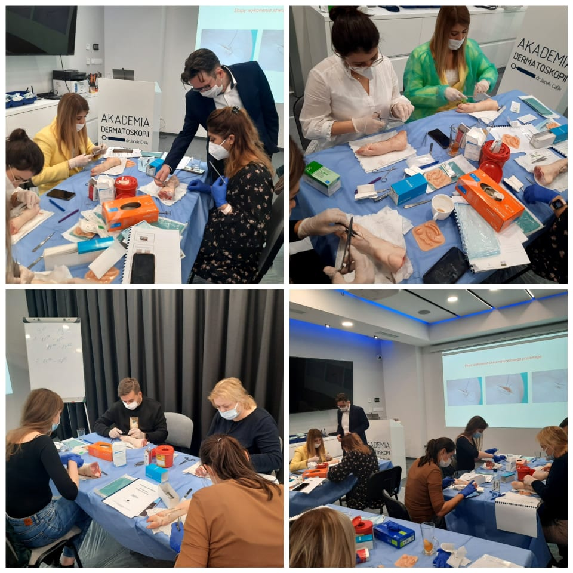

Za nami piewszy w tym roku intensywny kurs z Chirurgii skóry! Kierownikiem naukowym i prowadzącym kurs był dr n. med. Marek Łuciuk. Zajęcia praktyczne trwały od wczesnego ranka aż do samego wieczora! Dziękujemy za zaangażowanie wszystkich uczestniczących w kursie lekarzy! Jesteśmy pod wrażeniem Państwa wytrwałości i chęci doskonalenia swoich umiejętności! Wkrótce podany zostanie termin kolejnego kursu z Chirurgi skóry!

Niezmiennie zapraszamy na kolejne kursy dermatoskopowe!

Wszystkie terminy dostępne na stronie [https://akademiadermatoskopii.pl/kursy/](https://akademiadermatoskopii.pl/kursy/?fbclid=IwAR0H61bfn7iC1zyhVhndm4s8do_gdlsSh5RHdM1NLfcnJv0_vWZc5Jerjko)

Zapisów można dokonywać poprzez zamieszczony formularz kontaktowy [https://akademiadermatoskopii.pl/kontakt/](https://akademiadermatoskopii.pl/kontakt/?fbclid=IwAR1D6o6pcrkF2zwAakw6lcpoSHVIHF8xPbOvSNQCB7oIlJAFKxgMTH8eN1s) lub telefonicznie 516-516-065

-   
