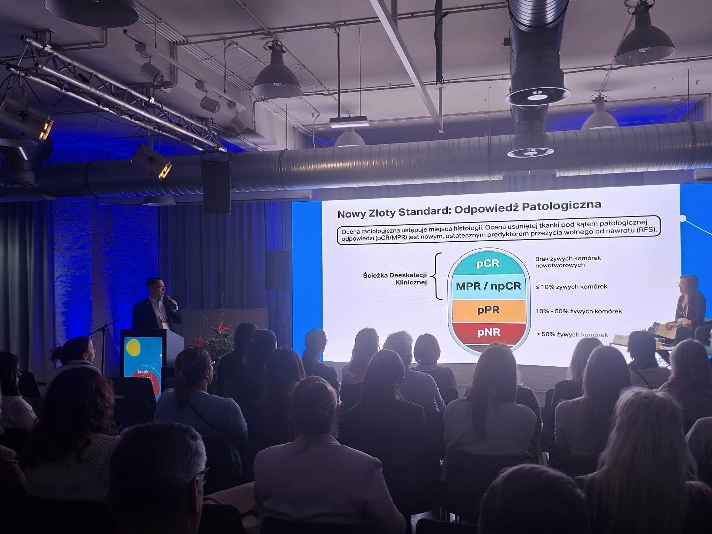

Za nami sesja dermatoonkologiczna podczas IV Konferencji Dermatoscopy Insights i wykład dr hab. n. med. Jacka Calika „Immunoterapia czerniaka w leczeniu adjuwantowym”. Przewodniczącymi sesji dr hab. n.med. prof. Madgalena Ciążyńska oraz dr hab. n.med. Jacek Calik

