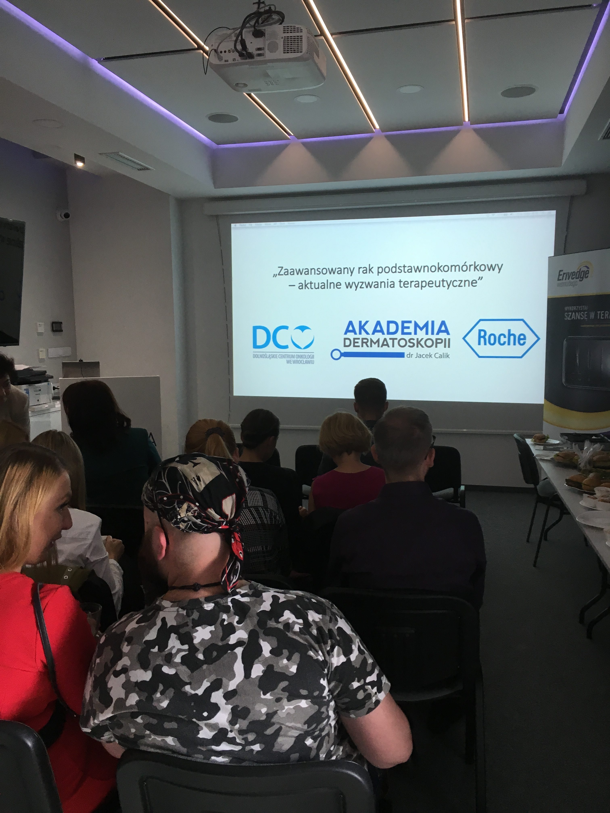
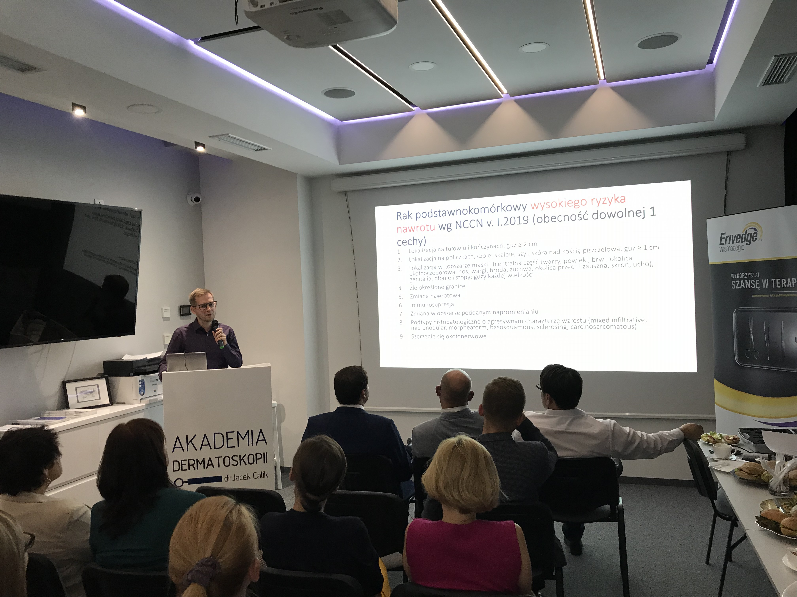
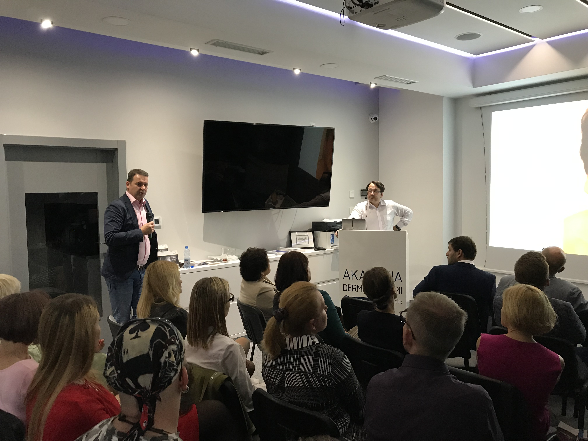
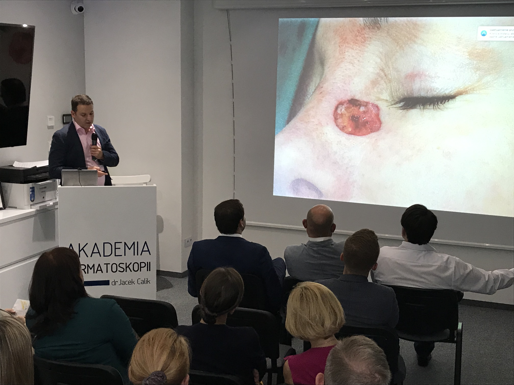
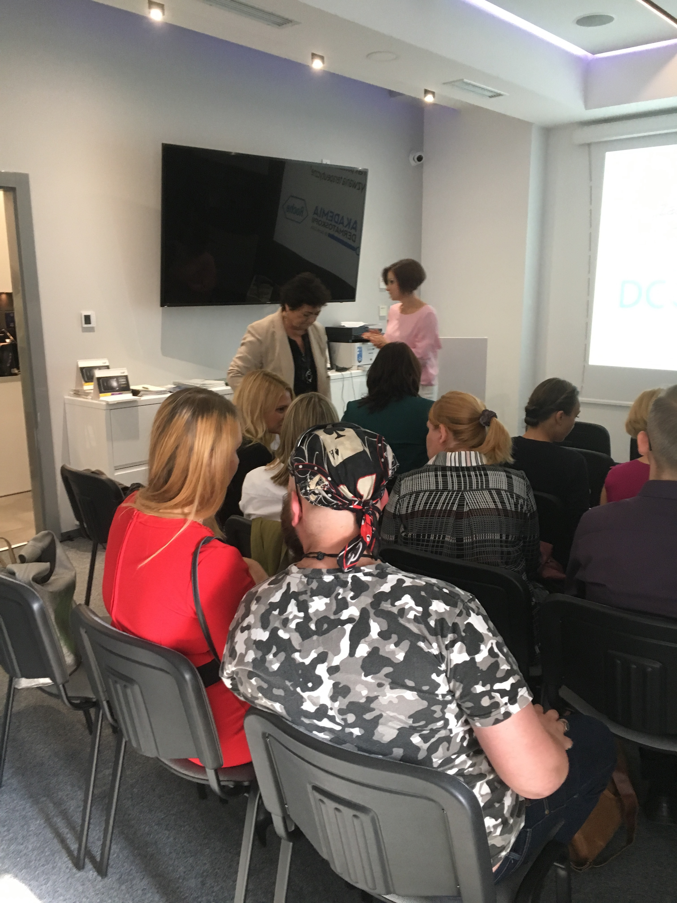

12.09.2019 odbyło się wielodyscyplinarne spotkanie lekarzy onkologów pod przewodnictwem dr n.med Emilii Filipczyk-Cisarż pt.:  
„Zaawansowany rak podstawnokomórkowy – aktualne wyzwania terapeutyczne”.

-   
    
-   
    
-   
    
-   
    
-   
