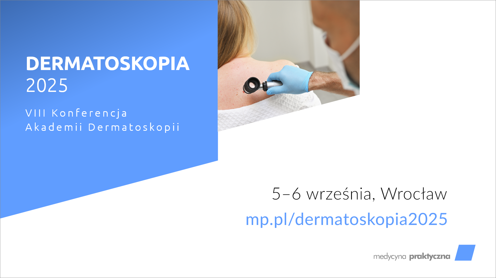
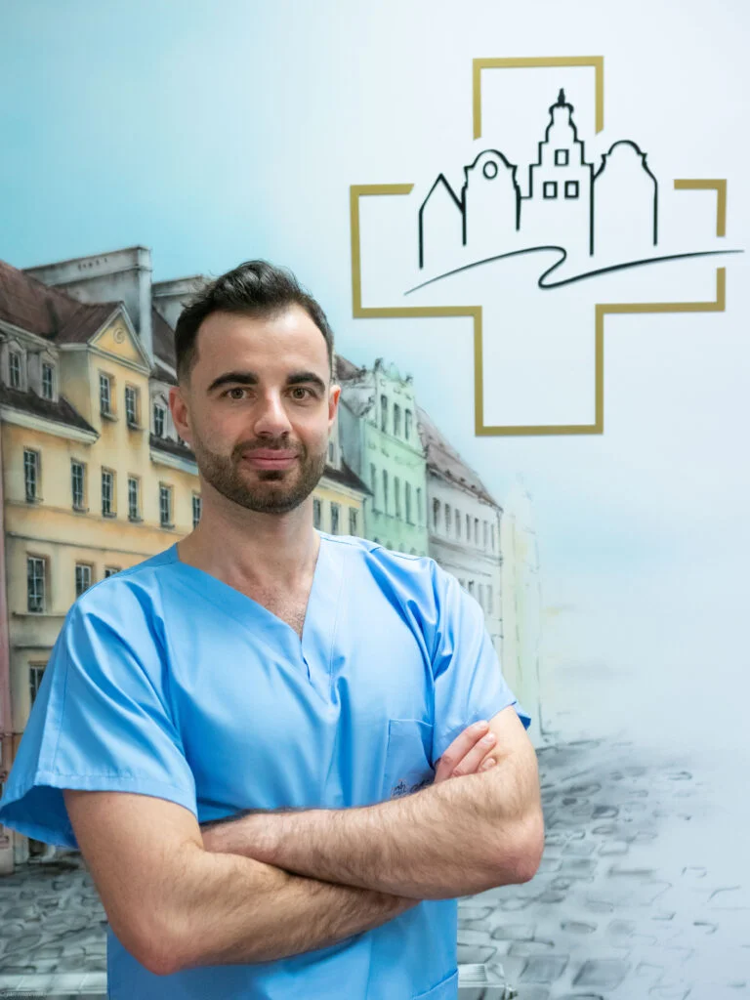
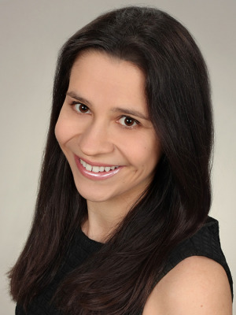

Zacznij wrzesień intensywnymi warsztatami i spotkaniami z ekspertami z dermatoskopii – tylko we Wrocławiu!

5 września to pierwszy dzień VIII Konferencji Akademii Dermatoskopii. Zaczynamy od Warsztatów Praktycznych!

Mamy 8 warsztatów, a każdy uczestnik może wybrać 2 z nich!

Dziś wiecej o warsztatach z dermatoskopii skóry twarzy!

Warsztat: Dermatoskopia skóry twarzy

 VIII Konferencja Akademii Dermatoskopii

Czy wiesz, że skóra twarzy to najtrudniejsza lokalizacja dermatoskopowa, jeśli chodzi o trafność diagnostyczną? To właśnie na twarzy najczęściej dochodzi do błędów rozpoznania – dlatego tak ważne jest, aby doskonalić swoje umiejętności w tym zakresie.

Podczas VIII Konferencji Akademii Dermatoskopii zapraszamy na specjalistyczny warsztat poświęcony wyłącznie dermatoskopii skóry twarzy, który zmieni Twoje spojrzenie na codzienną praktykę dermatologiczną i pozwoli uniknąć diagnostycznych pomyłek, szczególnie przed zabiegami estetycznymi czy chirurgicznymi.

Prowadzący warsztat:

• dr n. med. Katarzyna Korecka – specjalistka dermatologii z wieloletnim doświadczeniem klinicznym, pracująca w Oddziale Chorób Skóry Szpitala Wojewódzkiego w Poznaniu oraz w Katedrze i Klinice Dermatologii Uniwersytetu Medycznego w Poznaniu.

Mistrzyni Świata w Dermatoskopii – tytuł zdobyty podczas VI Światowego Kongresu Dermatoskopii w Buenos Aires w październiku 2024!

• lek. Bartosz Woźniak – doświadczony dermatolog, ceniony wykładowca Akademii Dermatoskopii, autor licznych publikacji naukowych w zakresie dermatologii oraz pasjonat praktycznej edukacji lekarzy.

Dlaczego warto wziąć udział?

• Nauczysz się rozpoznawać podstępne zmiany na twarzy, które często imitują łagodne lub złośliwe jednostki chorobowe.

• Dowiesz się, jak bezpiecznie planować zabiegi na twarzy z uwzględnieniem dermatoskopii.

• Poznasz kluczowe różnice diagnostyczne między zmianami na twarzy a innymi obszarami ciała.

Warsztat szczególnie polecany dla lekarzy wykonujących zabiegi na twarzy – zarówno dermatologów, jak i lekarzy medycyny estetycznej oraz chirurgów.

Rejestracja: [https://www.mp.pl/konferencje/akademia-dermatoskopii/2025/](https://www.mp.pl/konferencje/akademia-dermatoskopii/2025/?fbclid=IwZXh0bgNhZW0CMTAAYnJpZBEwUEl6b3FJelpxTEhDNEp2QQEekM323dVFK_KxVwcL9HsVrwbrSlmrzgwOZbtGzc9CSep0cw7Lq1l9G8nrLGc_aem_nRidOQ70BMFijDX0XobfWQ)

Doświadczaj, pytaj, analizuj – nauka w praktyce z pasją!

