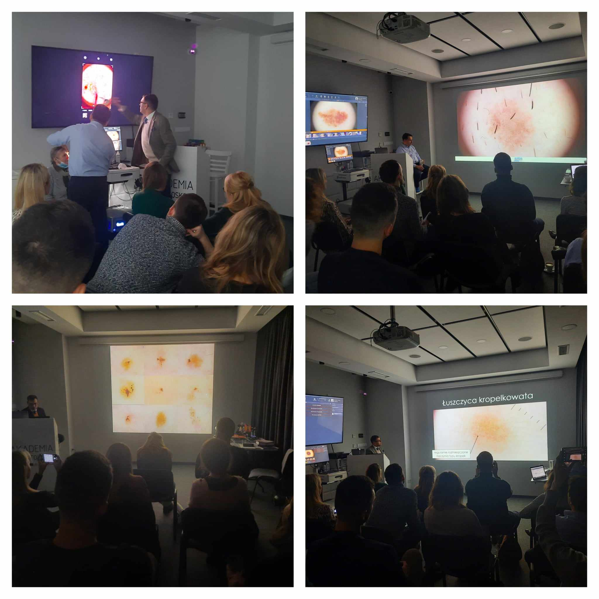

Zainteresowanie kursem dermatoskopowym na poziomie zaawansowanym jest tak duże, że musieliśmy wyznaczyć dodatkowy termin!  
Zapraszamy w dniach: 7-8 czerwca 2024  
Prowadzący: dr n.med. Jacek Calik i dr n.med. Paweł Pietkiewicz  
Agenda kursu dostępna na stronie: [https://akademiadermatoskopii.pl/kursy/](https://akademiadermatoskopii.pl/kursy/)  
Zapisy niezmiennie: 516 516 065 lub kontakt@akademiadermatoskopii.pl  
Do zobaczenia!

