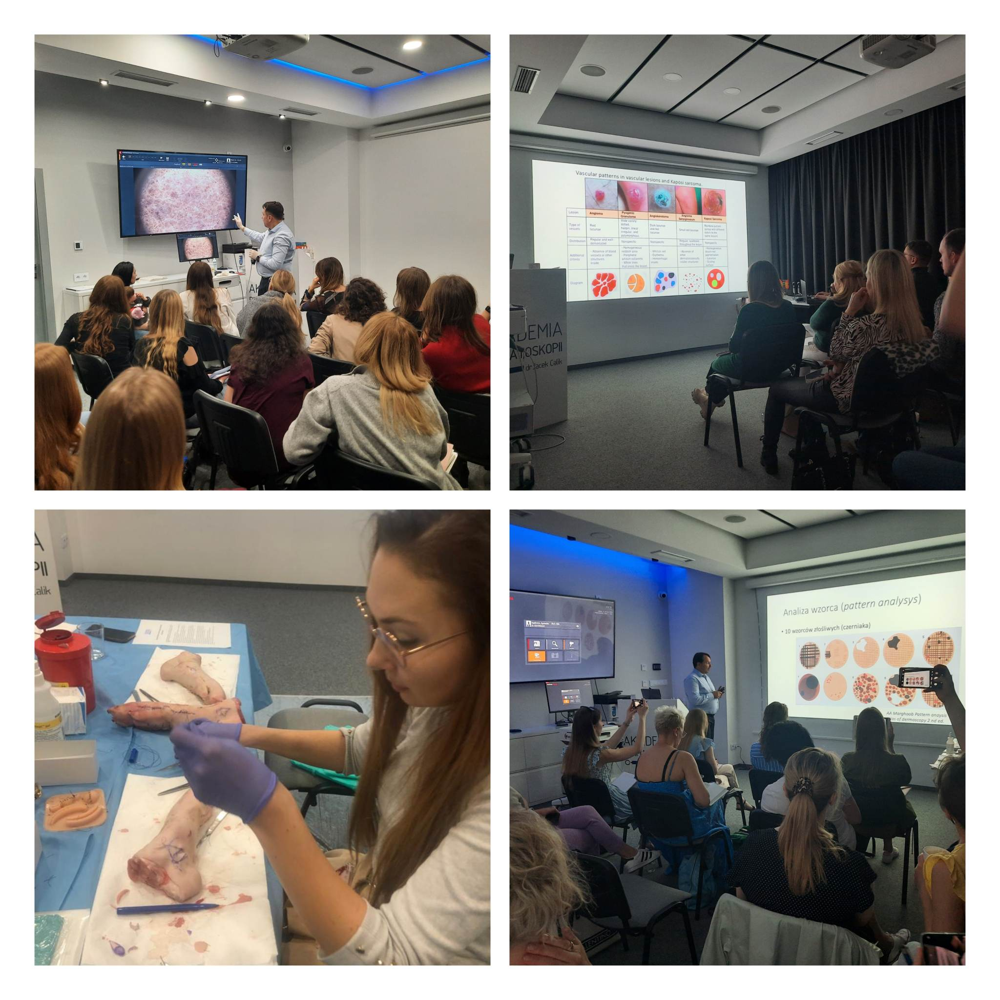

Zbliża się koniec roku, a więc także czas noworocznych postanowień.

My niezmiennie jesteśmy zdania, że najepszą inwestycją jest inwestycja w wiedzę i umiejętności!  
Dlatego zapraszamy Państwa do wzięcia udziału w organizowanych przez Akademię Dermatoskopii kursach!  
Oto terminy na pierwszą połowę 2023 roku!!!  
Wrocław, 27-28.01.2023 Kurs dermatoskopowy podstawowy  
Wrocław, 04.02.2023 Kurs Chirurgia Skóry (Intensywne warsztaty praktyczne, kurs jednodniowy)  
Wrocław, 10-11.03.2023 Kurs dermatoskopowy podstawowy  
Wrocław, 24-25.03.2023 Kurs dermatoskopowy zaawansowany  
Wrocław, 15.04.2023 Kurs Chirurgia Skóry (Intensywne warsztaty praktyczne, kurs jednodniowy)  
Wrocław, 28-29.04.2023 Kurs dermatoskopowy podstawowy  
Wrocław, 19-20.05.2023 Kurs dermatoskopowy podstawowy  
Wrocław, 16-17.06.2023 Kurs dermatoskopowy podstawowy  
Wrocław, 24.06.2023 Kurs Chirurgia Skóry (Intensywne warsztaty praktyczne, kurs jednodniowy)  

Zapraszamy do zapisów przez stronę [https://akademiadermatoskopii.pl/kontakt/](https://akademiadermatoskopii.pl/kontakt/) lub do kontaktu telefonicznego 516-516-065  
Do zobaczenia!

