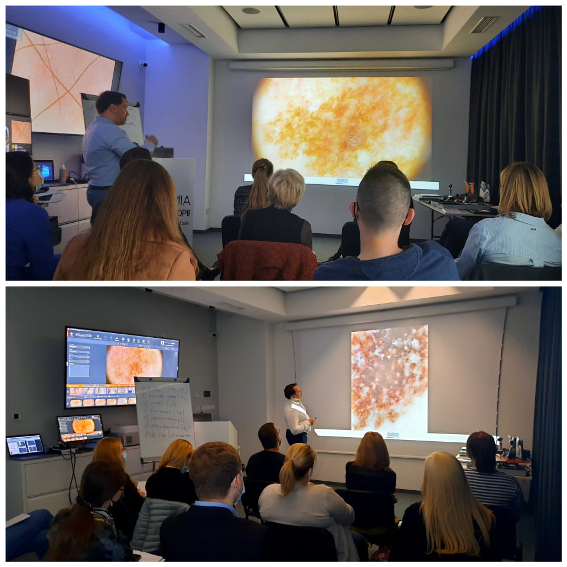

Zbliża się ostatni w tym roku Kurs dermatoskopowy na poziomie podstawowym!

Termin: 10-11.12.2021

Miejsce szkolenia: Akademia Dermatoskopii ul. Wyspiańskiego 11 Wrocław

Zakres szkolenia:

Obecne możliwości technologiczne diagnostyki nowotworów skóry

Badanie dermatoskopowe oraz struktury dermatoskopowe – nazewnictwo

Diagnostyka zmian barwnikowych skóry – wzorce barwnikowe i algorytmy

Dermatoskopia nowotworów niebarwnikowych skóry – raki skóry

Czerniaki skóry – rozpoznanawanie

Zmiany akralne i podpaznokciowe

Czerniaki skóry twarzy

Przydatkowiaki

Czerniaki błony śluzowej jamy ustnej

Przykład badania wideodermatoskopowego – warsztaty

Zastosowanie dermatoskopii w onkologii i w innych dziedzinach medycyny

Zapraszamy do zapisów przez stronę [https://akademiadermatoskopii.pl/kontakt/](https://l.facebook.com/l.php?u=http%3A%2F%2Fakademiadermatoskopii.pl%2Fkontakt%2F%3Ffbclid%3DIwAR23EaGEtrBPAk1qlX7iVrzspIVFoHSLXShTO9EhUpPdUKHwjklvcvy2yk8&h=AT2CpOpRWs8CDfSRuFDF3CVkg6WxIE0ii0wMnr-3cHC2krnP5HCuv5BLhJE3WpPov_BImVRgD-R53Ve9s956wdVpQSLpZ5ZKsZP8rleFltBwnng5JcwKnTS7fwOaaTJT9eID&__tn__=-UK-R&c[0]=AT1Z89H1XT8Kvw1QLK5l_ddtblmN0noVsobzAojgA-VIlXUafDrSjjp9dZq0DRp7bn4C3P08-ayJcFC2mySUVADApJGD_UkWz2ek4mm_Va6MNEnvmV5Nh5tiJY2bTC4bBJdsscr3IQ_1VKt8W-AJoly0k1tninP3B8DFUWFmMOYF1A)lub do kontaktu telefonicznego 516-516-065

Do zobaczenia!

