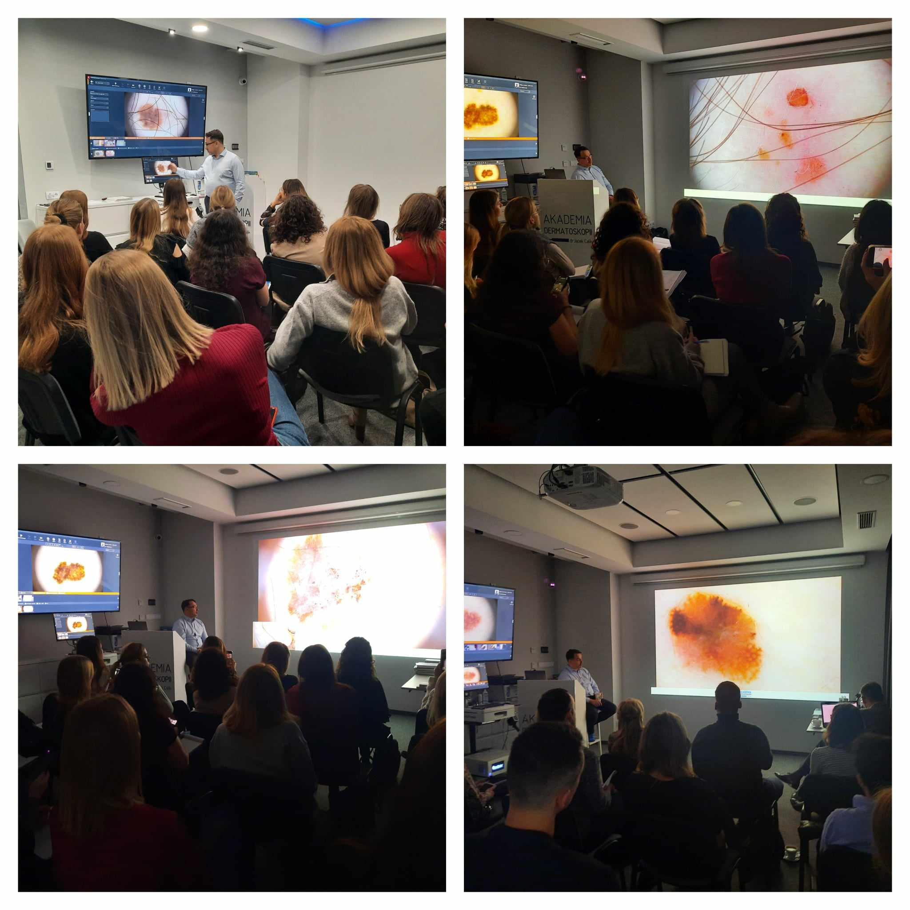

Zostały nam jedynie 3 wolne miejsca na kurs dermatoskopowy podstawowy w terminie 17-18.05.2024!

Prowadzący: dr n.med. Jacek Calik

Agenda kursu dostępna na stronie: [https://akademiadermatoskopii.pl/kursy/](https://akademiadermatoskopii.pl/kursy/?fbclid=IwZXh0bgNhZW0CMTAAAR2L5xNjwVgFPyMPALPmM5sonBNRHka74KvjYupSGAcXydBynRD6HkvOhD4_aem_AdCb-IrbHyUKgZsDG17sg0CKkO5etBAzLXqqtMcIm4Cik1Th_STQbNJ3w37aE4K-_aIo-vJN2rs2r4p9z5AdY3Tw)

Zapisy: 516 516 065, kontakt@akademiadermatoskopii.pl lub przez formularz rejestracyjny zamieszczony na stronie [https://akademiadermatoskopii.pl/kursy/](https://akademiadermatoskopii.pl/kursy/?fbclid=IwZXh0bgNhZW0CMTAAAR2i_rL87w26mYJpNtesc0HQ97BOIrzChTcyEP41st0RoClWMliaiiTyXy8_aem_AdDAQiGaKrd2pGv_Bt6Adr-1sP7c7Rqr7ssDCw4OvjeEr7-0vHpDXh0Fp6jWTnQfqjqm9yECSHpBD0s2m0NDCsYr)

Do zobaczenia!

